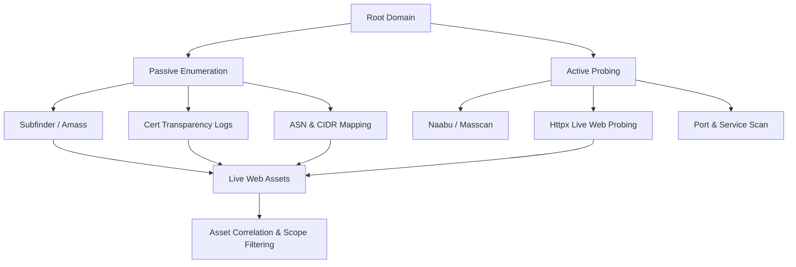

## 🎯 Phase Overview
Reconnaissance is the foundation of bug bounty hunting. The objective of this phase is to map out the entire external footprint of a target organization. A wider and more accurate map reveals endpoints that are often overlooked by other hunters.



---

## 🔍 1. Passive Reconnaissance

Passive reconnaissance involves gathering information without directly sending packets to the target’s systems. This prevents triggering WAFs and intrusion detection systems.

### A. Subdomain Harvesting
We query multiple public search engines, passive DNS records, and historical databases to compile a list of subdomains:

```bash
# Subfinder harvests subdomains from 30+ passive sources
subfinder -d target.com -all -recursive -o subdomains_passive.txt

# Amass uses advanced DNS harvesting, scraping, and APIs
amass enum -passive -d target.com -o amass_passive.txt
```

### B. Certificate Transparency (CT) Logs
Every SSL/TLS certificate issued is recorded in public transparency logs. Monitoring these logs can reveal newly created subdomains instantly:

```bash
# Query crt.sh database for wildcards
curl -s "https://crt.sh/?q=%25.target.com&output=json" | jq -r '.[].name_value' | sed 's/\*\.//g' | sort -u > cert_subdomains.txt
```

### C. ASN & IP Space Discovery
For larger target organizations, we locate their Autonomous System Number (ASN) to find the raw IP ranges they own:

```bash
# Find ASN matching organization name
curl -s "https://bgp.he.net/search?q=Target+Org" | grep -oE "AS[0-9]+"

# Enumerate IP blocks belonging to the ASN
amass intel -asn 12345 -o asn_ips.txt
```

---

## ⚡ 2. Active Reconnaissance

Active reconnaissance interacts directly with target systems to confirm live services, discover open ports, and probe protocols.

### A. Port Scanning
We scan open IP ranges or discovered subdomains for non-standard ports (e.g. 8080, 8443, 9000, 27017):

```bash
# Naabu performs extremely fast port scans across all 65,535 ports
naabu -list subdomains_passive.txt -p - -rate 5000 -o active_ports.txt

# Detailed service enumeration on open ports using Nmap
nmap -sC -sV -p 22,80,443,8080,8443 -iL live_hosts.txt -oN nmap_details.txt
```

### B. Live Web Asset Probing
Not all subdomains point to active websites. We probe hosts to see if they respond to HTTP/S and identify their software stack:

```bash
# Probe for HTTP/S servers, status codes, and tech stack
httpx -l active_ports.txt -sc -title -tech-detect -o live_web_assets.txt
```

---

## 🛠️ 3. Automation Recon Pipeline

To stay competitive, we automate the initial recon workflow. This pipeline runs continuously and filters out-of-scope assets:

```bash
#!/bin/bash
# continuous_recon.sh

TARGET=$1
OUT_DIR="recon_$TARGET"
mkdir -p "$OUT_DIR"

echo "[+] Starting passive enumeration..."
subfinder -d "$TARGET" -silent -o "$OUT_DIR/subfinder.txt"
amass enum -passive -d "$TARGET" -silent -o "$OUT_DIR/amass.txt"

cat "$OUT_DIR/subfinder.txt" "$OUT_DIR/amass.txt" | sort -u > "$OUT_DIR/all_subs.txt"

echo "[+] Filtering active HTTP/S targets..."
cat "$OUT_DIR/all_subs.txt" | httpx -silent -sc -title -tech-detect -o "$OUT_DIR/live_web.txt"

echo "[+] Recon completed! Output saved in $OUT_DIR/live_web.txt"
```
