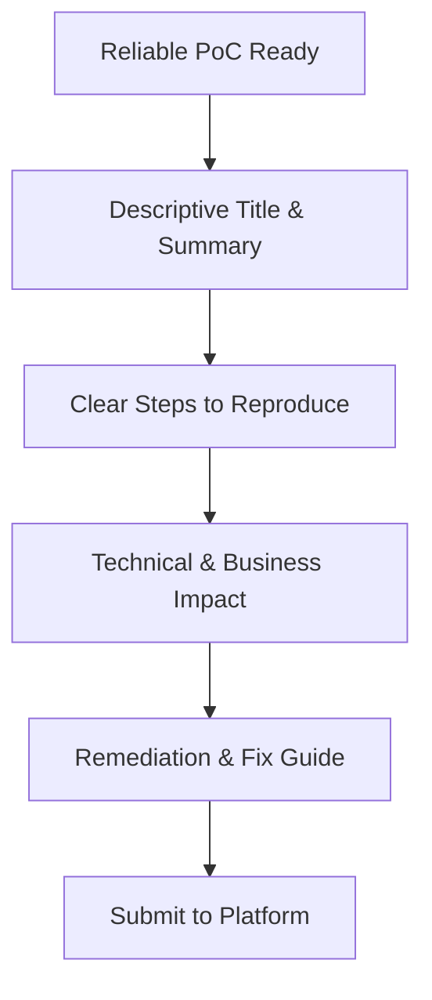

## 🎯 Phase Overview
Reporting is the final and most critical phase of bug bounty hunting. The quality of your report directly influences the triager's understanding, the developers' ability to remediate the issue, and the final bounty payout. A well-written report leads to faster validation and fewer arguments about severity.



---

## 📝 1. Report Structure

Every professional report should follow a standardized structure, enabling triagers to quickly validate the vulnerability.

### A. Title & Metadata
The title should be concise but highly descriptive, outlining the **vulnerability**, the **component**, and the **impact**:
*   *Bad*: `XSS on target.com`
*   *Good*: `Stored XSS in user profile name field leading to Session Hijacking on target.com/settings`

### B. Summary
Provide a high-level summary of the bug:
> "A stored Cross-Site Scripting (XSS) vulnerability was identified in the user profile settings page. By submitting a payload in the `nickname` field, the payload is executed in the browser context of any user visiting the profile. This allows an attacker to hijack the session cookie."

### C. Steps to Reproduce
Write step-by-step instructions that are clean and clear. Avoid vague instructions:
1. Register a user on `https://target.com/signup`.
2. Navigate to `https://target.com/settings`.
3. In the "Nickname" input field, paste the following payload: `<svg onload=alert(document.cookie)>`.
4. Click "Save Settings".
5. Log in as a different user and visit the profile of the first user: `https://target.com/profile/user1`.
6. Observe the alert dialog pop up containing cookie values.

---

## 📋 2. Markdown Vulnerability Template

We use the following template to submit reports on HackerOne or Bugcrowd:

```markdown
# [Stored XSS in user profile settings leading to Admin Session Hijacking]

## Summary
A brief description of the vulnerability and where it is located.

## Vulnerability Details
* **Vulnerable URL**: `https://target.com/settings`
* **Vulnerable Parameter**: `nickname`
* **Vulnerability Type**: Stored Cross-Site Scripting (XSS)

## Steps to Reproduce
1. Log in to your account.
2. Go to settings and input `<svg onload=alert(document.cookie)>` in the nickname field.
3. Save changes.
4. Visit the public page to trigger the execution.

## Proof of Concept
```html
<svg onload=alert(document.cookie)>
```
[Insert Screenshot / Link to Video PoC here]

## Technical Impact
An attacker can execute arbitrary JavaScript code in the user's browser session. If an admin visits the page, the attacker can steal the `session_id` cookie and take full administrative control over the website.

## Remediation / Mitigation
Filter and sanitize all user input before storing it in the database, and encode it in the HTML context before outputting it. Ensure the `HttpOnly` flag is set on sensitive cookies.
```

---

## 🤝 3. Triage Communication & Best Practices

How you communicate with security teams determines your reputation and long-term success.

### Bounded Rules:
*   ✅ **Be Professional & Courteous**: Triagers are human. Treat them with respect.
*   ✅ **Provide Complete Context**: If a bug requires specific configuration, provide it.
*   ✅ **Respect Scope**: Do not argue if a host is out of scope.
*   ❌ **Do Not Beg for Bounties**: Payouts are handled according to the program's policy.
*   ❌ **Do Not Disclose Publicly**: Keep details private until the vendor explicitly permits disclosure.
