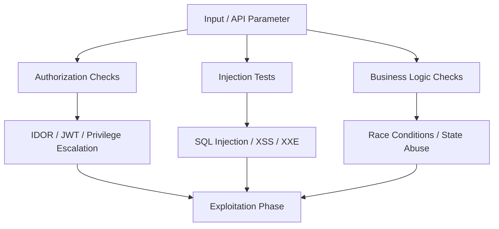

## 🎯 Phase Overview
Vulnerability Analysis is the testing phase. With the endpoints and parameters mapped out, we proceed to perform systematic audits on the input entry points to identify logic flaws, access control failures, and injection holes.



---

## 🛡️ 1. Authentication & Access Control

Access control flaws are among the most impactful vulnerabilities in modern applications.

### A. Insecure Direct Object References (IDOR)
IDOR occurs when an application provides direct access to objects based on user-supplied input:

1. **Verify ID Encrypt/Hasing**: Identify if object IDs are sequential (`/api/v1/user/1001`) or GUID/UUIDs. If UUID, check if there is an endpoint that leaks them.
2. **Parameter Polling**: Change identifiers in headers, cookies, or parameters to other user IDs:
   * Try changing `X-User-Id: 54` to `X-User-Id: 1`.
   * Try array parameters: `{"user_id": [54, 1]}`.

### B. JWT Flaws & Bypasses
Many modern applications use JSON Web Tokens (JWT) for authentication. We test for standard weaknesses:

*   **None Algorithm**: Modify the token header algorithm to `"alg": "none"`, remove the signature block, and send the request.
*   **Weak Secret HMAC Key**: Attempt offline cracking of the signature using `hashcat` with a dictionary list of common secrets:
    ```bash
    hashcat -m 16500 jwt.txt rockyou.txt
    ```
*   **Algorithm Confusion (RS256 to HS256)**: Change the algorithm from RS256 (asymmetric) to HS256 (symmetric) and sign the token using the target server's public key (often available publicly).

---

## 💉 2. Injection Vulnerabilities

Injection occurs when untrusted user input is parsed directly as commands.

### A. SQL Injection (SQLi)
We test for Union-based, Error-based, and Blind (Boolean/Time) SQL injections:

*   **Union SQLi Testing**: Inject `' UNION SELECT 1,2,3...` to determine the column count and matching types.
*   **Blind Time-based Testing**: Inject payloads that coerce the database to execute sleep commands:
    *   *MySQL*: `sleep(5)`
    *   *PostgreSQL*: `pg_sleep(5)`
    *   *MSSQL*: `waitfor delay '0:0:5'`

### B. Cross-Site Scripting (XSS)
We audit context-sensitive input fields to verify if input filters can be bypassed:

*   **HTML Context**: Test standard tags: `<script>alert(1)</script>` or ``.
*   **Attribute Context**: Break out of string attribute inputs using `"` or `'` delimiters: `" autofocus onfocus=alert(1) x="`.
*   **JavaScript Context**: If input is embedded inside script tags, break out of local script variables: `'; alert(1); //`.

---

## 🌐 3. Server-Side Attacks

These target server resources, cloud infrastructure, and internal networks.

### A. Server-Side Request Forgery (SSRF)
SSRF lets an attacker coerce the application to send HTTP requests to internal networks or local host ports:

*   **Internal Service Mapping**: Test parameters that take URLs (e.g. `?url=...`) by pointing to internal ranges:
    *   `http://localhost:22` (SSH)
    *   `http://127.0.0.1:6379` (Redis console)
*   **Cloud Metadata Harvesting**: Point payloads to cloud metadata APIs to harvest IAM role credentials:
    *   *AWS/OpenStack*: `http://169.254.169.254/latest/meta-data/`
    *   *Azure*: `http://169.254.169.254/metadata/instance?api-version=2021-02-01`
    *   *GCP*: `http://metadata.google.internal/computeMetadata/v1/`

### B. XML External Entity (XXE) Injection
We test applications parsing XML inputs by referencing external entities:

```xml
<?xml version="1.0" encoding="ISO-8859-1"?>
<!DOCTYPE foo [
  <!ELEMENT foo ANY >
  <!ENTITY xxe SYSTEM "file:///etc/passwd" >]>
<user><username>&xxe;</username><password>pass</password></user>
```
If the parser returns the output or executes an HTTP request, LFI or SSRF is confirmed.
