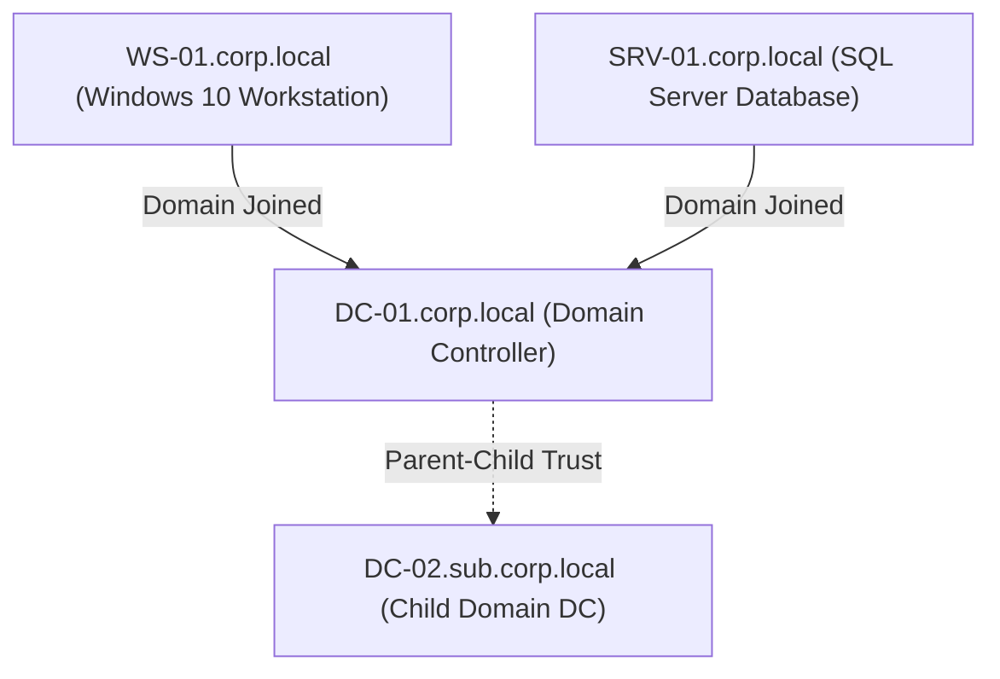

## Lab Architecture

The Active Directory Security Lab is a local virtualized environment designed to model realistic enterprise networks, enabling safe simulation of active directory attacks, privilege escalation, and configuration auditing.

### Lab Specifications

*   **Hypervisor**: VMware ESXi / Proxmox VE
*   **Virtual Machines**:
    *   **DC-01 (Windows Server 2019)**: Primary Domain Controller for `corp.local` domain. Handles Active Directory Domain Services (AD DS) and Active Directory Certificate Services (AD CS).
    *   **DC-02 (Windows Server 2016)**: Child Domain Controller for `sub.corp.local`.
    *   **SRV-01 (Windows Server 2019)**: Dedicated SQL database server running MSSQL service.
    *   **WS-01 (Windows 10 Pro)**: Corporate user workstation simulating day-to-day employee activity.
*   **Provisioning Tool**: Automated installation via Vagrant and custom PowerShell DSC configurations.

---

## Simulated Vulnerabilities & Attack Paths

The environment is configured with common enterprise security flaws to test attack vectors:

### 1. Active Directory Certificate Services (AD CS) ESC1 Abuse
*   **Misconfiguration**: Certificate template configured with `CT_FLAG_ENROLLEE_SUPPLIES_SUBJECT` allowing the enrollee to specify a Subject Alternative Name (SAN). The template is accessible to all domain users.
*   **Attack Vector**: Using Certify or Certipy to request a certificate as a standard domain user while specifying the Domain Administrator as the SAN, obtaining a PFX certificate to authenticate as Domain Admin.

### 2. Kerberos Unconstrained Delegation
*   **Misconfiguration**: `SRV-01` server is trusted for unconstrained delegation.
*   **Attack Vector**: Compromise `SRV-01`, trigger a connection from a Domain Controller (e.g., via Printer Bug or PetitPotam), capture the DC's TGT ticket from memory (LSASS), and impersonate the DC.

### 3. Group Policy Preference (GPP) Credential Leaking
*   **Misconfiguration**: Legacy GPP XML files left in the SYSVOL share containing encrypted local administrator passwords.
*   **Attack Vector**: Locate `Groups.xml` in SYSVOL, extract the `cpassword` attribute, decrypt it using the known AES key, and use the credentials for initial access.
