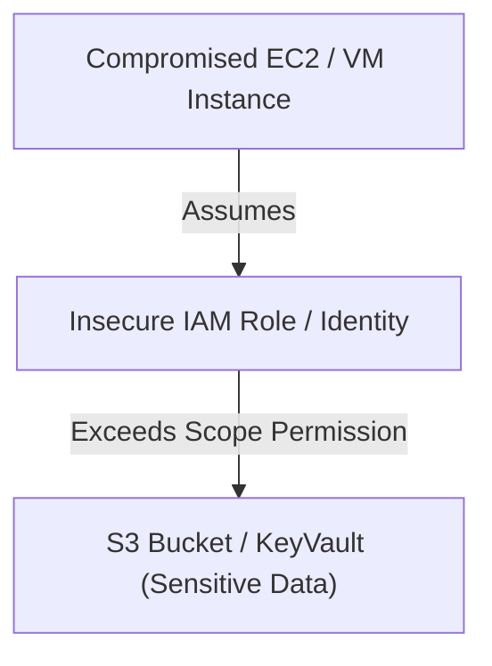

## Lab Architecture

The Cloud Security Lab models common misconfigurations and privilege escalation vectors found in modern cloud deployments (Amazon Web Services and Microsoft Azure).



### Environment Configurations

*   **AWS Lab**:
    *   **Resource Group**: Isolated sandbox running a Kubernetes cluster (EKS) and several EC2 instances.
    *   **Misconfiguration 1**: EC2 instance profile contains an IAM role with `iam:PassRole` and `ec2:CreateInstanceProfile` permissions.
    *   **Misconfiguration 2**: S3 Bucket configured with public listing enabled and a policy permitting read access to authenticated AWS users.
*   **Azure Lab**:
    *   **Resource Group**: Enterprise Active Directory integrated tenant.
    *   **Misconfiguration 1**: User Assigned Managed Identity attached to a VM with Owner permissions over a KeyVault.
    *   **Misconfiguration 2**: Insecure App Registrations holding client secrets in plain text metadata.

---

## Staged Cloud Attack Paths

### 1. AWS IAM Privilege Escalation via PassRole
*   **Vector**: An attacker gains initial access to an EC2 instance profile.
*   **Execution**:
    1.  Enumerate permissions using `aws iam list-attached-role-policies`.
    2.  Identify `iam:PassRole` and `ec2:RunInstances`.
    3.  Launch a new EC2 instance with an administrator role attached, effectively bypassing initial user restrictions.

### 2. Azure KeyVault Exfiltration
*   **Vector**: Managed Identity assigned to a compromised web application VM.
*   **Execution**:
    1.  Query the local Instance Metadata Service (IMDS) to request an Azure AD token for the managed identity:
        ```bash
        curl -H "Metadata: true" "http://169.254.169.254/metadata/identity/oauth2/token?api-version=2018-02-01&resource=https://vault.azure.net"
        ```
    2.  Use the received JWT to query the targeted KeyVault API and dump stored secret keys.
