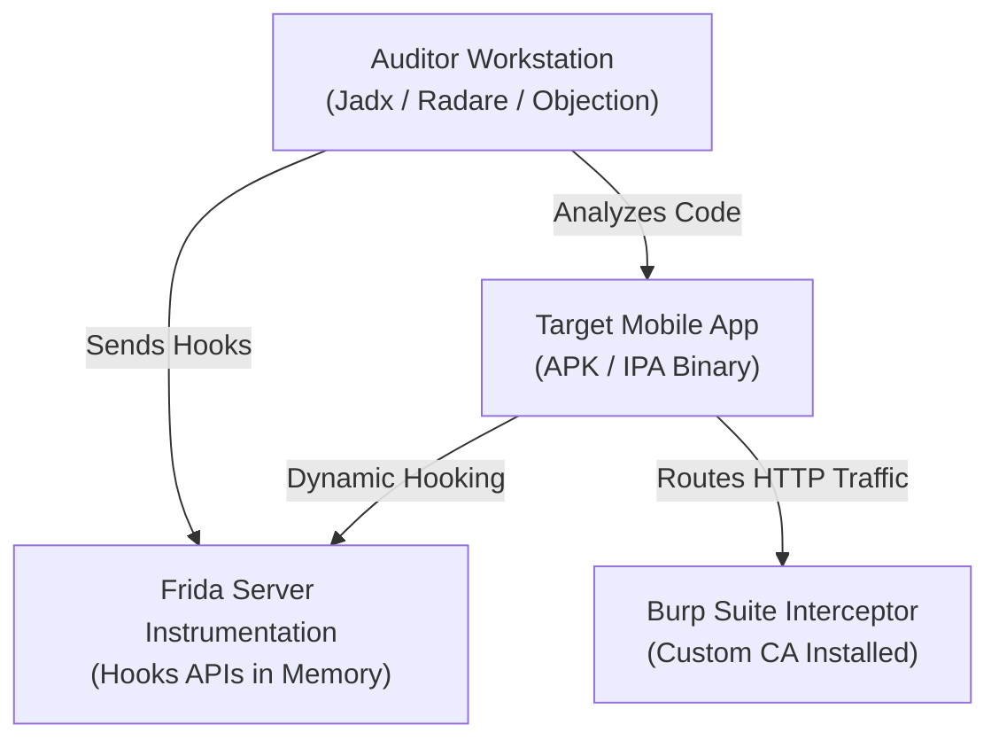

## 📱 Mobile Application Security Lab

The Mobile Security Lab is configured to perform comprehensive static and dynamic audits of mobile applications (Android APK/AAB files and iOS IPA packages). This environment leverages physical rooted/jailbroken devices alongside emulator instances to bypass anti-tampering defenses and capture runtime traffic.



### 📋 Technical Specifications

*   **Android Testing Node**:
    *   **Physical Endpoint**: Rooted Google Pixel 4a running an open-source LineageOS build.
    *   **Emulator Nodes**: Genymotion running rooted Android x86 Virtual Devices.
    *   **Instrumentation**: `frida-server` binary configured to listen on localhost via Android Debug Bridge (ADB).
*   **iOS Testing Node**:
    *   **Physical Endpoint**: Jailbroken iPhone 8 running iOS 14.8 using the checkra1n bootrom exploit.
    *   **Instrumentation**: OpenSSH for terminal access, Cydia Substrate for runtime loading, and `frida-server` for hook insertion.
*   **Auditing Suite**:
    *   **Workstation Tools**: MobSF (Mobile Security Framework), Jadx-gui, Hopper Disassembler, and IDA Pro.
    *   **Dynamic Command Utilities**: Frida CLI, Objection runtime shell, and Burp Suite Pro.

---

## 🔬 Testing Methodologies & Playbooks

### 1. SSL Pinning Bypassing (Frida & Objection)
*   **Concept**: Modern security-conscious apps enforce SSL pinning, refusing to establish TLS connections if the certificate chain does not match built-in public keys.
*   **Bypass Playbook**:
    1.  Install the Burp Suite certificate on the device trust store (system or user store).
    2.  Start the application on the device.
    3.  Attach to the application process using Objection to patch standard networking libraries (OkHTTP, TrustManager, etc.) in memory.
*   **Command Execution**:
    ```bash
    # Run Objection, attach to target package, and disable pinning
    objection --gadget "com.target.app" explore
    
    # Inside the objection interactive shell:
    android sslpinning disable
    ```

### 2. Local Storage and Keystore Auditing
*   **Concept**: Auditing if user credentials, session tokens, or API keys are written unencrypted to the flash memory of the device instead of using secure keystores.
*   **Audit Playbook**:
    1.  Navigate to the application sandbox directory.
    2.  Dump databases, configuration XMLs, and plist structures.
    3.  Analyze stored elements for cleartext secrets.
*   **Command Execution (Android)**:
    ```bash
    # Spawn terminal shell as root
    adb shell
    su
    
    # Access target app database directory
    cd /data/data/com.target.app/databases/
    
    # Inspect SQLite database tables
    sqlite3 offline_cache.db "SELECT * FROM cache_records;"
    ```
*   **Command Execution (iOS)**:
    ```bash
    # Connect via SSH over TCP redirection (usbmuxd)
    ssh root@localhost -p 2222
    
    # Find application container UUID path
    find /var/mobile/Containers/Data/Application/ -name "TargetApp.app"
    
    # View local preferences dictionary list
    plutil -p /var/mobile/Containers/Data/Application/[UUID]/Library/Preferences/com.target.app.plist
    ```

---

### 🔗 Back to Hub
- [Return to Security Labs Hub]({{ '/labs/' | relative_url }})
