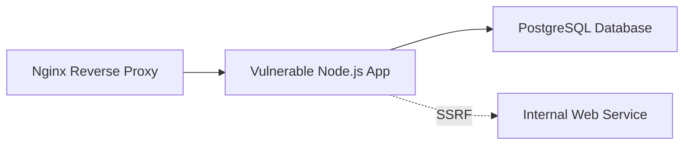

## Lab Architecture

The Web Application Security Labs consist of multiple containerized services mimicking modern web stacks. This isolation allows safe testing of advanced server-side vulnerabilities and exploit payload staging.

### Stack Components

*   **Front-End Reverse Proxy**: Nginx container handling request routing.
*   **Vulnerable Backend Application**: Node.js/Express application implementing vulnerable API routes.
*   **Database Backend**: PostgreSQL container holding simulated customer information and authorization hashes.
*   **Internal Service**: Isolated container representing internal resources only accessible from the local network (used for SSRF staging).

---

## Lab Challenges & Exploitation Scenarios

### 1. SSRF to Internal Cloud Metadata
*   **Vulnerability**: An image import endpoint takes a user-supplied URL and fetches it without proper validation.
*   **Scenario**: Hijack the server to query internal service endpoints or mock cloud metadata endpoints (e.g., `http://169.254.169.254/latest/meta-data/` for AWS role keys).

### 2. White-box JWT Vulnerability
*   **Vulnerability**: The authorization service accepts JWTs signed with the `none` algorithm or checks symmetric secrets using weak signatures.
*   **Scenario**: Audit the Node.js source code, craft a forged JWT with administrator claims, sign it with `none` or a brute-forced key, and bypass administrative controls.

### 3. Second-Order SQL Injection
*   **Vulnerability**: An application profiles registration parameter stores input unsanitized in the database. A subsequent reporting engine retrieves and uses this input directly in database queries.
*   **Scenario**: Register an account with a malicious SQL payload as the user name. Trigger the report generation function to execute arbitrary database commands.
